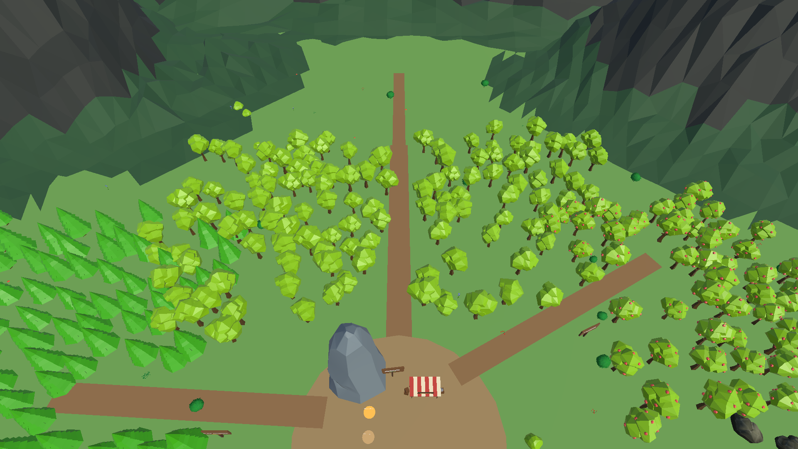
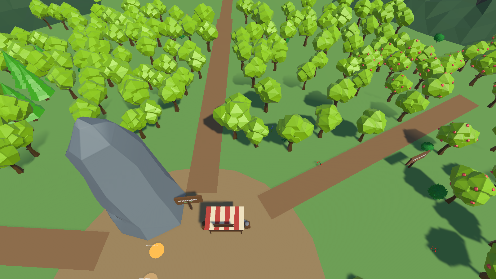
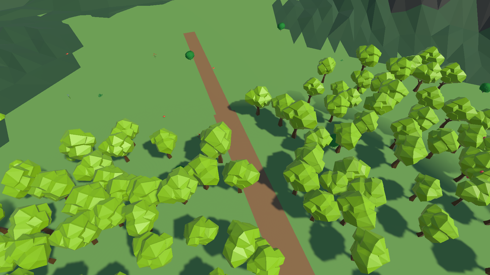
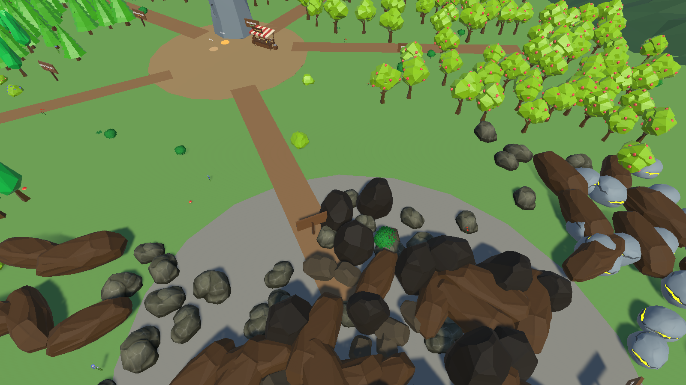
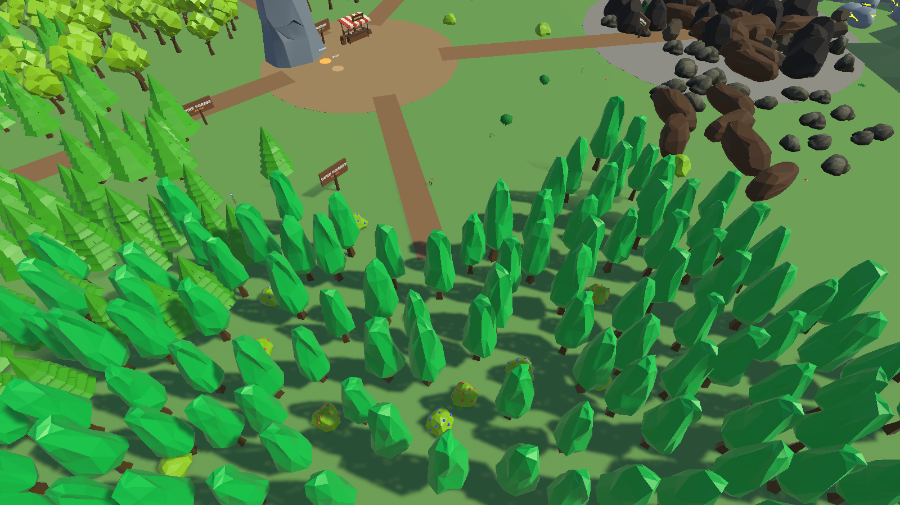

**A low-poly survival-tycoon for Android. Chop, mine, hunt, sell, upgrade — and survive the predators that show up once you're rich enough to be worth eating.**

[](https://github.com/cr0sz/Timberline/releases/latest)
&nbsp;




Start with a rusty axe and an empty bag. Chop wood, mine stone, hunt deer, sell the haul,
and sink every coin back into better gear. Each upgrade cracks open a richer zone — six of
them, radiating out from camp, each one paying more than the last. Then the wolves come.
Then the tiger. Then the bear. The richer you get, the more the valley wants you dead.

Six zones. Twelve buildable structures. Five things to upgrade. One valley that keeps
raising the stakes.

> ### ▶ [**Download & play (APK v0.2.0)**](https://github.com/cr0sz/Timberline/releases/latest)
> Sideload it on any Android phone — no account, no store, no sign-up.

<sub>Built solo in Unity 6.3 LTS (URP, C#). Everything below the fold is the engineering
write-up — architecture, systems, balance maths, and the shipped bugs pinned by tests.</sub>

| | |
|---|---|
|  |  |
| **Base camp** — market stall, upgrade pads, the menhir | **Meadow (Lv1 axe)** — where every run starts |
|  |  |
| **Quarry (Lv1 pickaxe)** — the stone lane | **Deep forest (Lv15 axe)** — 170 nodes, the endgame zone |

---

## Table of contents

- [Play it](#play-it)
- [The core loop](#the-core-loop)
- [Architecture](#architecture)
- [Systems in depth](#systems-in-depth)
  - [Player](#player)
  - [Gathering](#gathering)
  - [Combat and creatures](#combat-and-creatures)
  - [Economy](#economy)
  - [Building](#building)
  - [Persistence](#persistence)
  - [UI, feel and mobile](#ui-feel-and-mobile)
- [The map](#the-map)
- [Balance reference](#balance-reference)
- [Editor tooling](#editor-tooling)
- [Tests](#tests)
- [Design decisions worth knowing](#design-decisions-worth-knowing)

---

## Play it

1. **[Download the APK](https://github.com/cr0sz/Timberline/releases/latest)** (~64 MB).
2. Copy it to an Android phone and tap it.
3. Allow "install from unknown sources" when Android asks — that's the standard prompt for
   anything that didn't come from the Play Store.

Drive with the floating touch joystick: put your thumb anywhere on the left of the screen
and the stick appears under it. Chopping, mining and fighting are automatic — stand still,
face the thing, and your character swings.

### Build from source

Open the project in Unity 6.3 LTS, load `Assets/Scenes/Map.unity`, press Play. WASD/arrows
drive the player in the editor. Build target is Android; `MobileBootstrap` uncaps the
framerate to 60 and forces the `Mobile` quality level on real handhelds.

There is no launcher scene: the title screen is a panel over the already-loaded map with
`timeScale` pinned to 0, not a second scene. It reads "PLAY" on a fresh install and
"CONTINUE" once a save exists, and the "New Game" button under it only appears when
there is something to wipe. Pause and sound live in the in-game settings sheet.

---

## The core loop

```
                   ┌──────────────────────────────────────────────┐
                   │                                              │
                   ▼                                              │
   ┌─────────┐  gather   ┌──────────┐  walk to  ┌──────┐  sell  ┌──────┐
   │ Resource│ ────────► │ Bag      │ ────────► │ Shop │ ─────► │Coins │
   │ nodes   │           │(capacity)│           │      │        │      │
   └─────────┘           └──────────┘           └──────┘        └──┬───┘
        ▲                                                          │
        │                                                          │ spend
        │  unlocks                                                 ▼
   ┌────┴─────────────────┐                    ┌──────────────────────────────┐
   │ better zones         │ ◄───────────────── │ Axe / Pickaxe / Weapon       │
   │ (gated on tool tier) │                    │ Bag / Speed  ·  Buildables   │
   └──────────────────────┘                    └──────────────────────────────┘
```

Three things make that loop tighten rather than flatten:

1. **Zones are gated on tool tier, not on distance.** A Lv15 poplar refuses a Lv14 axe
   outright. Distance is flavour; the tier is the wall.
2. **A node is worth a fixed total.** A better tool harvests it in fewer swings, never
   for fewer units. (See [`ResourceNode.TotalYield`](Assets/Scripts/ResourceNode.cs).)
3. **The bag is the throttle.** Capacity starts at 25 and caps at 300, so the trip to the
   shop is always part of the cost of a haul — and dying en route costs you 30% of it.

Hunting is a parallel lane: meat and hide need no tool tier at all, only a weapon good
enough to survive the animal.

---

## Architecture

### Assemblies

| Assembly | Path | Purpose |
|---|---|---|
| `Survival.Runtime` | `Assets/Scripts` | All gameplay. Ships in the build. |
| `Survival.Editor` | `Assets/Editor` | Scene generators and bakers. Editor-only. |
| `Survival.Tests.EditMode` | `Assets/Tests/EditMode` | NUnit EditMode suite. |

Splitting these out means a change to a generator does not recompile the game, and the
test assembly can reference NUnit without leaking it into the player build.

### Execution order

Only two scripts care:

- `AudioManager` — `[DefaultExecutionOrder(-100)]`, so its static instance exists before
  anything tries to play a clip in its own `Start`.
- `SaveManager` — `[DefaultExecutionOrder(1000)]`, so `Load()` runs **after** every other
  system's `Start()` and overwrites their defaults rather than being overwritten by them.

That ordering is load-bearing. `CreatureSpawner.Start` reads `SaveManager.HasSave`
(a file-existence check, deliberately not dependent on `Load` having run) to decide
whether this is run #1 and the predator ramp should arm.

### How things talk

State changes fan out through C# events rather than polling:

```
PlayerInventory.OnInventoryChanged ─┬─► HUD.Refresh
                                    ├─► Shop.Refresh          (repaint cards + prices)
                                    ├─► ObjectiveManager.Check (advance goals)
                                    └─► SaveManager.MarkDirty  (throttled autosave)

PlayerStats.OnStatsChanged ─────────► ObjectiveManager.Check
PlayerHealth.OnHealthChanged ───────► HUD.RefreshHealth
PlayerHealth.OnDamaged ─────────────► PlayerHitFeedback (flash + shake + knockback)
PlayerHealth.OnRespawn ─────────────► anything that resets on death
ObjectiveManager.OnObjectiveChanged ► HUD.RefreshObjective
ObjectiveManager.OnAllComplete ─────► VictoryPanel (fires once, on a live transition only)
```

The one static registry is `Campfire.All`, so `Creature` can test every fire's repel
radius per frame without a `FindObjectsByType`.

---

## Systems in depth

### Player

**[`PlayerController.cs`](Assets/Scripts/PlayerController.cs)** — `CharacterController`
movement, camera-relative. Reads `Gamepad.leftStick` (the touch joystick feeds a virtual
gamepad) with a keyboard fallback for editor testing. Also owns:

- The animator `Speed` param, scaled by `moveSpeed / baseMoveSpeed` so a speed-upgraded
  player doesn't foot-slide.
- `AddKnockback(velocity)` — exponential decay with a 0.1s time constant, applied on top
  of movement so a hit shoves you ~0.35 m: enough to feel, not enough to break your
  retaliation range.
- `LateUpdate` camera follow via `SmoothDamp` (0.12s), which reads far better on a phone
  than a hard lock.

**[`PlayerHealth.cs`](Assets/Scripts/PlayerHealth.cs)** — 100 HP. Regen is 3 HP/s starting
7 s after the last hit. A 1 s invulnerability window after each hit stops a pack from
chain-stunning you.

The important mechanic is **`HealBlocked`**: for 5 s after any damage, `Heal()` returns
early. It lives in `PlayerHealth`, not in `Campfire`, so *every* current and future healer
is covered by one guard — otherwise you could stand in a fire and out-heal a predator
between its swings. `Shop` reuses the same flag as its definition of "in combat" so the
shop and the campfire agree on one notion of a fight.

Death teleports you to `spawnPoint` (the last campfire built, else the map spawn),
refills HP, and applies the penalty: **30% of carried resources and 10% of coins**.
The `CharacterController` is disabled around the teleport because it resists direct
position writes.

**[`PlayerInventory.cs`](Assets/Scripts/PlayerInventory.cs)** — a
`Dictionary<ResourceType,int>` plus coins and capacity. `Add()` clamps to remaining space
and **returns how much actually fit**, so callers can report overflow; it discards the
rest silently and `PlayerGatherer` turns a `0` return into a throttled "Bag full!" toast.
`SellAll` converts everything carried to coins at `Shop`-supplied prices.

Save support is deliberate: `LoadState` sets coins/capacity/resources **directly** rather
than replaying `AddCapacity`, so reloading can't double your bag.

**[`PlayerStats.cs`](Assets/Scripts/PlayerStats.cs)** — lifetime cumulative counters
(wood gathered, stone gathered, total, kills). Separate from `PlayerInventory` precisely
because inventory goes *down* when you sell, and "chop 500 wood" must not un-complete
itself the moment you cash in.

**[`ToolInventory.cs`](Assets/Scripts/ToolInventory.cs)** — the tool maths, by formula
rather than a lookup table, so tiers 4–15 keep improving instead of flatlining:

```csharp
interval      = max(minInterval, baseInterval * intervalDecay^(tier-1))   // 0.93^n, floor 0.2
hitsReduction = (tier-1) / tiersPerHitReduction                           // +1 every 2 tiers
weaponDamage  = round(weaponBaseDamage * weaponDamageGrowth^(tier-1))     // 4 * 1.25^n
```

Weapon *interval* is deliberately flat at 0.8 s — only damage scales, so a weapon upgrade
reads as "hits harder" rather than quietly also doubling your DPS twice over.

### Gathering

**[`ResourceNode.cs`](Assets/Scripts/ResourceNode.cs)** — a tree or a rock.

`TotalYield()` returns the explicit `totalYield` override when set, else
`hitsToDeplete × amountPerHit`. Every scene node uses the override. `Hit(hitsReduction)`
then pays out `ceil(total / threshold)` per swing and **dumps the entire remainder on the
felling blow**, clamped so the node can never overpay:

```csharp
threshold = max(1, hitsToDeplete - hitsReduction);
payout    = (currentHits >= threshold) ? remaining
                                       : min(ceil(total / threshold), remaining);
```

This shape exists because of a shipped bug: yield used to be `amountPerHit × hits`, and
since a better tool *cut the hit count*, a Lv10 axe felled a Lv1 tree in two swings and
got two wood out of it. `EconomyTests.BetterToolNeverHarvestsForLess` pins it.

On depletion the node runs a coroutine: disable collider → topple (trees pivot about
their ground contact with a `u²` ease so it accelerates like a real fall) or sink (rocks)
→ hide renderers → spawn a stump → wait 30–60 s → restore. The collider does **not** come
back while the player is standing on the trunk, because popping it on would shove the
`CharacterController`.

**[`PlayerGatherer.cs`](Assets/Scripts/PlayerGatherer.cs)** — auto-swings at the nearest
valid node. Targeting is `OverlapSphereNonAlloc` (32-collider buffer; a dense forest
exceeds 16) filtered by three rules:

1. **Distance to the trunk**, not collider overlap — tree colliders are one convex hull
   around the whole canopy, so overlapping one means nothing.
2. **`FacingCheck.InFront`** — you must be looking at it.
3. **Tool tier** ≥ `requiredToolLevel`, else it nags "Need Lv15 axe" once a second.

You also have to be standing still (`!playerController.IsMoving`).

**[`FacingCheck.cs`](Assets/Scripts/FacingCheck.cs)** — shared by gathering and combat so
the axe and the spear agree. A horizontal-plane dot product against a 70° half-angle
(a 140° cone). Horizontal-only on purpose: looking slightly up or down a slope must not
stop you chopping. Both systems used to pick targets on distance alone, so you chopped
trees with your back to them.

### Combat and creatures

**[`PlayerCombat.cs`](Assets/Scripts/PlayerCombat.cs)** — mirrors the gatherer: same
overlap query, same facing gate. Swings are **held while moving** so the attack clip never
plays mid-run, but the timer is kept primed at the full interval so stopping next to an
animal lands a hit immediately instead of making you wait out a fresh cooldown.

`Swing()` fires an animator **trigger**, not a bool. It used to be a bool held true while
a creature was in range, which meant the attack clip played once, hit its last frame, and
froze there — the only exit from the state was the bool going false.

**[`Creature.cs`](Assets/Scripts/Creature.cs)** — one animal, `Predator` or `Prey`.

*Movement* is `CharacterController`-driven but the *direction* comes from a real NavMesh
path (`NavMesh.CalculatePath`, recomputed every 0.35 s or early when the destination
drifts 1.5 m). There is deliberately **no `NavMeshAgent`** — an agent would fight the
`CharacterController` for the transform and take gravity and the procedural lunge with it.
Using the static path API keeps the navigation system as a pure route oracle. A
`SphereCast`-and-slide fallback survives for unbaked scenes and is used *deliberately* for
the campfire retreat, which wants a straight line away from a thing rather than a route to
somewhere.

*Priorities* for a predator, in order: back out of any campfire repel radius → chase if
within `senseRange` → bite if within `attackRange`. Fire beats hunger, which is what makes
a built camp genuinely safe ground and the campfire worth its coins.

*The bite* is a procedural forward lunge (`sin(u·π)` offset applied as an incremental
delta so it layers on movement and nets to zero displacement). The animal packs ship with
only a locomotion blend tree, so there is no attack clip to play.

Two details that were bugs first:

- `ApplyGravity()` runs every frame. `CharacterController.Move` never applies gravity on
  its own, so an animal whose spawn raycast landed on another animal would hang in the air
  and "fly".
- All movement goes through `Translate()`, which calls `cc.Move`. Writing
  `transform.position` directly **teleports** a `CharacterController` — no sweep, no
  collision — which is why animals used to walk through the player.

Animator float params are resolved once at spawn against a known-names list
(`Speed`, `Vert`, `MoveSpeed`) because the asset packs don't agree, and setting a param
that doesn't exist is a silent no-op that leaves the animal frozen in its idle pose.

**[`CreatureSpawner.cs`](Assets/Scripts/CreatureSpawner.cs)** — keeps the world stocked,
seeding each kind to `max` and topping up every 6 s as they're hunted. Spawns land inside
`radius` 25 m, never within `minPlayerDist` 10 m of the player, and are dropped onto the
ground by raycast.

Its more interesting job is **pacing when each kind first appears**. A flat "no predators
for six minutes" gate was the first attempt and it was wrong: at minute six it dropped a
wolf pack *and* a tiger *and* a bear onto a player still holding a tier-1 spear. So the
delay is per kind and the opening escalates:

| t | Arrives | Why there |
|---|---|---|
| 0:00 | Deer ×3, Chicken ×4 | the world is alive and there is meat to hunt |
| 6:00 | Wolf ×3 | 20 HP each — a tier-1 spear wins, at a cost |
| 10:00 | Tiger ×1 | 45 HP, wants weapon Lv3+ |
| 15:00 | Bear ×1 | 90 HP, wants weapon Lv5+; pays 180 coins if you win |

Each kind toasts an arrival message and seeds to full in one go, because predators
silently materialising behind you reads as a bug rather than a turn in the game.

The ramp arms **only on run #1** (`SaveManager.HasSave == false`). Re-arming it on every
reload would be the same bug pointing the other way — an empty world every time you load.
The rule is extracted as a pure static so it is testable without a play-mode clock:

```csharp
public static bool IsHeld(float delay, float runStart, float now, bool armed)
    => armed && delay > 0f && now < runStart + delay;
```

### Economy

**[`Shop.cs`](Assets/Scripts/Shop.cs)** — a trigger volume around the market stall. Walk
in, the panel opens; walk out or take a hit, it closes. Five upgrade cards
(axe / pickaxe / bag / speed / weapon) and one SELL ALL button.

Pricing is geometric: `cost = round(baseCost × costGrowth^(level-1))` with
`costGrowth = 1.25`. It was 1.4, whose exponential tail put a maxed tool around 5 500
coins.

Repaint is **event-driven** (`OnInventoryChanged`), not per-frame, since the old version
rebuilt every card string every frame the panel was open.

Combat lockout is enforced in three places because each covers a different path:
`TryOpen` (walking in mid-fight), `Update` (getting hit while browsing — you don't haggle
with a bear on you), and a distance backstop for when the death respawn teleports you out
of the trigger without firing `OnTriggerExit`.

**[`ObjectiveManager.cs`](Assets/Scripts/ObjectiveManager.cs)** — a linear 28-goal chain,
re-evaluated on every inventory or stats change. Completing one pays coins and advances;
the `while` loop means satisfying several at once (or loading a save that already does)
settles correctly in one pass. A `checking` re-entrancy flag stops `AddCoins` →
`OnInventoryChanged` → `Check` from recursing.

The chain deliberately spans the *whole* progression — it used to end at 500 coins, which
is inside the first quarter of one upgrade track, after which it went silent for the rest
of the game. Goal tool levels line up with the zone gates (Lv5 opens the orchard and ore
field, Lv10 the pines, Lv15 the deep forest).

`OnAllComplete` fires only on a live transition, never when a finished save loads, or the
win screen would pop on every boot forever.

### Building

Two separate systems that both produce structures:

**Tycoon pads — [`UpgradeStation.cs`](Assets/Scripts/UpgradeStation.cs).** Walk onto the
pad; if you can afford the next tier it charges you and builds/upgrades in place. The pad
*is* the button — no panel. A world-space label shows the next cost, and the disc breathes
while you stand on it and punches on a successful buy (the pads were the one interactive
thing in the game with no feedback at all).

Two pads exist: **Campfire** (base 50) and **Storage** (base 60), both `×1.6` per tier,
max tier 4. Storage adds +25 bag capacity per tier.

**Build catalog — [`BuildSystem.cs`](Assets/Scripts/BuildSystem.cs) +
[`PlacementController.cs`](Assets/Scripts/PlacementController.cs).** The coin sink: 12
placeable structures, from a 25-coin fence to a 220-coin watchtower.

Placement is a **ghost preview**. A build-bar button arms a translucent clone; you drag it
along the ground, rotate in 45° steps, optionally snap to a 1 m grid. **Nothing is charged
until you confirm.** The ghost tints green/red from `IsValid()`, which requires both:

- the rotated footprint box overlaps no `PlacedBuildable`, `PlayerController`,
  `ResourceNode` or `Creature` (ground has none of those components, so it never blocks); and
- all four footprint corners find ground within `groundProbe` below, so nothing hangs off
  a ledge.

The same controller drives **MOVE**: tap MOVE, then tap a structure. The original hides
and disables its colliders (so it can't block its own ghost) and the same loop runs;
confirm writes the transform back, cancel restores it. Arming is required so you can't
grab a structure by accident.

A ghost is stripped on spawn — `PlacedBuildable` destroyed, colliders disabled,
MonoBehaviours and Lights disabled — so a hologram neither blocks the world nor runs
scripts.

`Campfire` is capped at `maxCount = 3` in the catalog, because a fire hands out a
predator-free radius and unlimited fires would let you pave the map into a no-predator
zone. The cap is checked twice: when arming (so a capped item never dangles a preview you
can't place) and again in `CommitPlace` (you could have placed the last one from a second
ghost while this one floated).

**[`Campfire.cs`](Assets/Scripts/Campfire.cs)** has three jobs: heals you inside `radius`
(subject to the global heal lockout), repels predators inside `repelRadius`, and becomes
your respawn point. Tier scales all of it:

```csharp
radius       = 3.5 + tier * 0.75
healPerSecond = 3   + tier * 2
repelRadius  = radius + 2.5      // the safe pocket always outruns the healing pocket
```

That last line matters: if they were equal, a bear would stand exactly on the line you
need to heal from.

Because campfires are catalog buildables now, a player can own several — so tier is a
**static shared value** (`Campfire.SharedTier`). The pad upgrades all of them, present and
future; paying once and finding your other two fires still weak would read as a bug. The
static is reset from the save on every load, including the tier-0 case, or a previous run's
upgrades would leak into a New Game.

The repel radius is drawn **only on the placement ghost**, via
[`GroundRing.cs`](Assets/Scripts/GroundRing.cs) — a `LineRenderer`, no decal, no shader.
A permanent ring around every fire was tried and rejected: three fires meant three orange
circles painted across camp at all times.

### Persistence

**[`SaveManager.cs`](Assets/Scripts/SaveManager.cs)** — JSON at
`Application.persistentDataPath/save.json`, schema version 8.

Saves on a throttled autosave (3 s after any inventory change), on `OnApplicationPause`
and on `OnApplicationQuit` — the pause hook is the mobile-critical one, since Android will
happily kill a backgrounded app without ever reaching `OnApplicationQuit`.

Persisted: coins, capacity, moveSpeed, health, all three tool tiers, capacity/speed levels,
carried resources (as parallel `int[]` arrays, because `JsonUtility` can't serialise a
dictionary), both pad tiers **and their built positions**, every placed buildable
(index + position + Y rotation), the objective index, the four lifetime stat counters,
and the prestige count.

**Migrations are mandatory when a build catalog entry is cut.** `buildIndices` stores raw
catalog positions, so removing an entry renumbers everything after it and an old save
rebuilds the wrong prefabs. v7 cut the Crate at index 10, moving Campfire 11 -> 10;
`RemapAfterCut` handles it as a pure function with `SaveMigrationTests` behind it. Cut
entries are **dropped**, never remapped — turning a player's crates into campfires would
hand out free predator-repel zones the 3-campfire cap exists to prevent.

Load order inside `Load()` is deliberate: stats before objectives, because
`ObjectiveManager.LoadIndex` re-evaluates goals against stats.

Version handling accepts anything from 1 to current — older files just deserialise with
newer fields null. Two schema notes worth knowing:

- The `hunger` field from v3 is gone (the hunger system was cut 2026-07-21).
  `JsonUtility` silently ignores unknown fields, so no version bump was needed.
- `ResourceType.Food` is **vestigial but must not be removed or reordered** —
  `resTypes` stores raw enum ints, so dropping `Food` would shift `Meat` 3→2 and
  `Hide` 4→3 and silently rewrite every existing save.

`DeleteSave()` (the pause menu's New Game) clears the file **and**
`PlayerPrefs[IntroTutorial.SeenKey]`. Progress lives in two places, and deleting only the
file left the how-to-play card suppressed forever after the first wipe. Mute stays — that's
a setting, not progress.

### UI, feel and mobile

| Script | What it does |
|---|---|
| [`HUD.cs`](Assets/Scripts/HUD.cs) | Resource pills, coins, bag bar, health bar, objective banner. Health has its own handler so a hit doesn't rebuild the inventory strings. |
| [`FloatingJoystick.cs`](Assets/Scripts/FloatingJoystick.cs) | Touch anywhere on a fullscreen zone and the stick appears under your finger. Feeds `<Gamepad>/leftStick`, so `PlayerController` needed no changes. The zone is the Canvas's *first* child, so real buttons sit above it in raycast order. |
| [`SafeArea.cs`](Assets/Scripts/SafeArea.cs) | Insets the HUD to `Screen.safeArea` for notches. Recomputes only when it actually changes. |
| [`SeeThrough.cs`](Assets/Scripts/SeeThrough.cs) | SphereCasts camera→player and fades blockers to 28% alpha. A 0.35 s hold time stops a canopy clipping the cast edge from strobing as you walk. |
| [`PlayerHitFeedback.cs`](Assets/Scripts/PlayerHitFeedback.cs) | Red flash + camera shake + knockback on `OnDamaged`. |
| [`CameraShake.cs`](Assets/Scripts/CameraShake.cs) | Trauma-based positional shake, layered on top of the follow offset. |
| [`FloatingText.cs`](Assets/Scripts/FloatingText.cs) | Pooled rising popups — fast tools spawn these many times a second. |
| [`BackCarryVisual.cs`](Assets/Scripts/BackCarryVisual.cs) | Your haul as a bundle on your back; scales down past a max height so a full bag always reads as "packed". |
| [`HeldToolSwap.cs`](Assets/Scripts/HeldToolSwap.cs) | One thing in hand at a time — axe while gathering, weapon while a creature is near, empty otherwise. Combat wins ties. |
| [`PanelPop.cs`](Assets/Scripts/PanelPop.cs) / [`UIFeedback.cs`](Assets/Scripts/UIFeedback.cs) | Panel scale-in, and button punch + card colour flash on buy/reject. Both run on **unscaled** time so they animate at `timeScale 0`. |
| [`Prestige.cs`](Assets/Scripts/Prestige.cs) | "New Valley" — +25% sell earnings per valley mastered. Static so it survives the scene reload that performs the reset, which is exactly why `DeleteSave` zeroes it: otherwise a wiped player keeps a permanent bonus. Applied at `Shop.PriceOf`, the single point every sale and every displayed price runs through. |
| [`TitleScreen.cs`](Assets/Scripts/TitleScreen.cs) | The front door, as a panel rather than a scene. Pins `timeScale` to 0, hides the HUD/BUILD/settings chrome outright (a 0.9 scrim only dims them to ~30% in linear colour), and defers the first-run how-to-play card until PLAY so two modals never stack. |
| [`PauseMenu.cs`](Assets/Scripts/PauseMenu.cs) | Freezes via `timeScale`. Mute drives `AudioListener.volume`, not the manager's master, so the author's mix trims survive. |
| [`ResetButton.cs`](Assets/Scripts/ResetButton.cs) | Two-tap guarded wipe, so a stray touch can't delete a run. |
| [`AudioManager.cs`](Assets/Scripts/AudioManager.cs) | One `AudioSource`, static entry points, `PlayOneShot` so overlapping clips need no pool. |
| [`VFXManager.cs`](Assets/Scripts/VFXManager.cs) | One-shot tinted particle bursts. Non-looping with `StopAction=Destroy`, so a burst cleans itself up. All calls null-safe. |

---

## The map

A ~200 m valley, mountains on all four sides, base camp at the origin. Six roads radiate
from the market hub.

```
                        z+ (north)
                            │
        Meadow_Oak_Lv1  ────┼────  Orchard_Apple_Lv5
              (-4, 38)      │           (48, 21)
                            │
   PineForest_Lv10 ─────  CAMP  ───── OreField_Lv5
        (-54, 2)         (0,0)          (77, -21)
                            │
   DeepForest_Poplar_Lv15   │      Quarry_Stone_Lv1
        (-28, -46)          │          (42, -32)
                            │
                        z- (south)
```

Base camp holds the market stall (`Shop`, at `3.5, 5`), the menhir landmark, and the two
tycoon pads (Campfire at `-4, 3`, Storage at `-4, 0`). Player spawn is `(0, -5)`.

Each zone has a signpost naming its tier.

---

## Balance reference

All of this is scene data, tunable from the Inspector without a recompile.

### Zones

| Zone | Tool | Nodes | Yield/node | Hits | Distance from shop | Zone stock |
|---|---|---|---|---|---|---|
| Meadow_Oak_Lv1 | Axe Lv1 | 120 | 5 wood | 5 | 13–68 m | 600 u = 1 800 c |
| Quarry_Stone_Lv1 | Pickaxe Lv1 | 113 | 6 stone | 6 | 40–76 m | 678 u = 2 034 c |
| Orchard_Apple_Lv5 | Axe Lv5 | 55 | 10 wood | 5 | 27–66 m | 550 u = 1 650 c |
| OreField_Lv5 | Pickaxe Lv5 | 124 | 11 stone | 6 | 55–103 m | 1 364 u = 4 092 c |
| PineForest_Lv10 | Axe Lv10 | 150 | 18 wood | 6 | 30–88 m | 2 700 u = 8 100 c |
| DeepForest_Poplar_Lv15 | Axe Lv15 | 170 | 26 wood | 7 | 39–84 m | 4 420 u = 13 260 c |

All nodes regrow in 30–60 s. **732 nodes total.** Every rock in a mine zone is a node — there are no un-mineable decoration rocks mixed in (fixed 2026-07-27).

Income at the node, at each zone's gating tier — this is the number that decides which
lane a player actually farms:

| Zone | Coins/sec |
|---|---|
| Meadow Lv1 | 3.0 |
| Quarry Lv1 | 3.0 |
| Orchard Lv5 | 13.4 |
| OreField Lv5 | 11.0 |
| Pine Lv10 | 51.9 |
| Deep forest Lv15 | 215.4 |

Monotonic, and stone slightly leads wood at each tier to pay for the longer walk.

### Prices

| Resource | Coins/unit |
|---|---|
| Wood | 3 |
| Stone | 3 |
| Meat | 10 |
| Hide | 20 |

### Upgrades

| Upgrade | Base cost | Growth | Cap | Effect per level |
|---|---|---|---|---|
| Axe | 20 | ×1.25 | Lv15 | −7% swing interval, +1 hit reduction every 2 tiers |
| Pickaxe | 20 | ×1.25 | Lv15 | same |
| Weapon | 50 | ×1.25 | Lv15 | ×1.25 damage (interval stays 0.8 s) |
| Bag | 40 | ×1.25 | Lv12 | +25 capacity |
| Speed | 40 | ×1.25 | Lv10 | +0.35 m/s |
| Campfire pad | 50 | ×1.6 | Lv4 | +0.75 m radius, +2 HP/s, +0.75 m repel |
| Storage pad | 60 | ×1.6 | Lv4 | +25 capacity |

Maxing one tool costs ≈ 1 760 coins. Speed tops out at 7.5 m/s — it was +0.5/level, which
reached 9 and crossed the whole map fast enough to make zone gating meaningless.

### Creatures

| Kind | Behaviour | HP | Damage | Interval | Speed | Sense | Drops | Value | Arrives |
|---|---|---|---|---|---|---|---|---|---|
| Chicken | Prey | 4 | — | — | 3.5 | 7 m | 1 meat | 10 c | 0:00 |
| Deer | Prey | 12 | — | — | 4.5 | 11 m | 3 meat + 1 hide | 50 c | 0:00 |
| Wolf ×3 | Predator | 20 | 8 | 1.2 s | 3.5 | 14 m | 2 meat + 1 hide | 40 c | 6:00 |
| Tiger ×1 | Predator | 45 | 10 | 1.6 s | 3.0 | 13 m | 5 meat + 3 hide | 110 c | 10:00 |
| Bear ×1 | Predator | 90 | 18 | 1.9 s | 2.6 | 14 m | 8 meat + 5 hide | 180 c | 15:00 |

Fight maths at the intended weapon tier: wolf at Lv1 costs ~24 damage, tiger at Lv3 ~40,
bear at Lv5 ~72 against a 100 HP pool. Each is winnable but expensive, which is the point.

### Player

| Stat | Value |
|---|---|
| Health | 100 |
| Move speed | 4 m/s (→ 7.5 maxed) |
| Bag capacity | 25 (→ 300 with bag upgrades + storage pad) |
| Gather / weapon range | 2.5 m / 2.6 m |
| Facing cone | 140° (70° half-angle) |
| Regen | 3 HP/s, 7 s after last hit |
| Heal lockout | 5 s after any hit |
| Invulnerability | 1 s after a hit |
| Death penalty | 30% of carried resources, 10% of coins |

---

## Editor tooling

Menu items under **Tools/Survival**:

| Script | Menu | What it does |
|---|---|---|
| [`TycoonSetup.cs`](Assets/Editor/TycoonSetup.cs) | Build scene | Generates the whole map — terrain, zones, camp, pads, signs, roads. |
| [`BuildCatalogSetup.cs`](Assets/Editor/BuildCatalogSetup.cs) | — | Builds the buildables catalog and the placement bar UI. |
| [`MarketSetup.cs`](Assets/Editor/MarketSetup.cs) | — | The market stall and merchant. |
| [`ParticleSetup.cs`](Assets/Editor/ParticleSetup.cs) | — | Generates the debris/spark/campfire particle prefabs. |
| [`NavMeshSetup.cs`](Assets/Editor/NavMeshSetup.cs) | Bake NavMesh | Bakes the surface `Creature` routes on. |
| [`ScreenshotTool.cs`](Assets/Editor/ScreenshotTool.cs) | Capture Screenshots | Renders the README shots from edit mode at the game's camera rig. Writes to `Screenshots/`. |
| [`RunAllTests.cs`](Assets/Tests/EditMode/RunAllTests.cs) | Run EditMode Tests | Runs the suite and prints one `[TESTS]` summary. |

**Re-bake the NavMesh after any change to terrain or static layout.** The bake collects
from *physics colliders*, not renderers — trees carry trunk-shaped capsules far narrower
than their canopies, and baking off render geometry would carve a hole the size of the
whole canopy and wall the forest off. Player-*placed* structures are runtime-spawned and
can never be in a bake; `Creature` covers that with its SphereCast fallback and by
re-pathing several times a second.

---

## Tests

EditMode suite in `Assets/Tests/EditMode` — run it from **Tools/Survival/Run EditMode
Tests** or the Test Runner window.

| File | Covers |
|---|---|
| `EconomyTests.cs` | Yield arithmetic, "a better tool never harvests for less", sell-price ordering across zones, mining-vs-chopping parity, the speed-upgrade ceiling. |
| `InventoryTests.cs` | Capacity clamping, overflow return values, `LoseFraction` rounding, save/load round-trip. |
| `CampfireTests.cs` | Tier scaling, repel radius always exceeding heal radius. |
| `FacingTests.cs` | The targeting cone, including the point-blank and zero-forward edge cases. |
| `GraceTests.cs` | `CreatureSpawner.IsHeld` — the predator ramp, armed and unarmed. |

The suite exists mostly as regression pinning: nearly every test in it corresponds to a
bug this project actually shipped.

---

## Design decisions worth knowing

Things that look odd until you know why:

- **No `NavMeshAgent` on creatures.** It would fight the `CharacterController`. The static
  `NavMesh.CalculatePath` API is used as a route oracle only.
- **Weapon interval never scales**, only damage — so an upgrade doesn't secretly
  double-dip on DPS.
- **`ResourceType.Food` is dead but permanent.** Removing it would corrupt every save.
- **The torch was cut** (2026-07-23). The game has no night, so "fire keeps them away"
  now lives on the one fire that costs something to build.
- **Hunger was cut** (2026-07-21) — see
  [`docs/superpowers/specs/2026-07-21-hunger-cut-design.md`](docs/superpowers/specs/2026-07-21-hunger-cut-design.md).
- **Campfire tier is static, not per-instance**, because you can own three of them and
  upgrading one should upgrade all.
- **The heal lockout lives in `PlayerHealth`**, not in the campfire, so one guard covers
  every healer that will ever exist.
- **Facing is checked at target *selection*,** not at swing time — so the "Need Lv15 axe"
  nag and the auto-swing both agree on what you're aimed at.
- **`ponytail:` comments** mark deliberate simplifications with a known ceiling (e.g.
  `Campfire.All` is a plain list because there are at most three fires). They name the
  upgrade path rather than pretending the shortcut isn't one.

Design specs for the bigger reworks live in
[`docs/superpowers/specs/`](docs/superpowers/specs/).
